# RenoCost - Kalkulator Kosztow Remontu

[**Otwórz aplikację**](https://selter2001.github.io/renovation-cost-app/)

Kalkulator kosztów remontu mieszkania. Dodaj pomieszczenia, podaj wymiary, wybierz prace remontowe i otrzymaj szczegółową wycenę z możliwością eksportu do PDF.

## Zrzuty ekranu

### Strona główna

| Tryb jasny | Tryb ciemny |
|:---:|:---:|
| 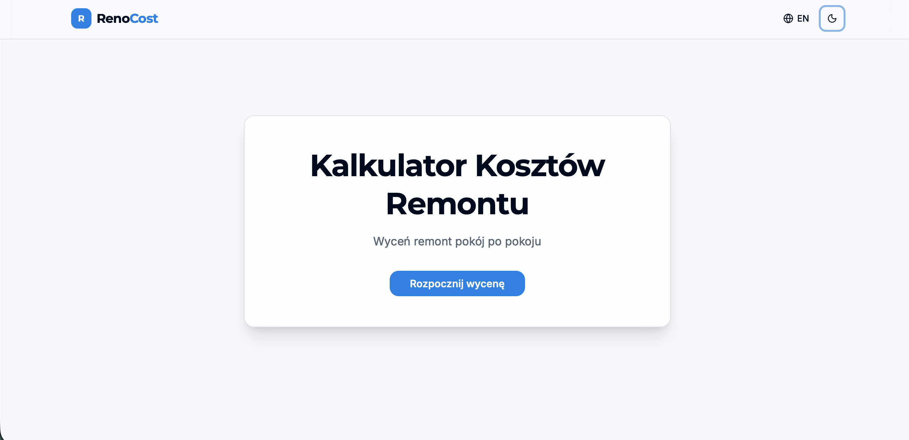 | 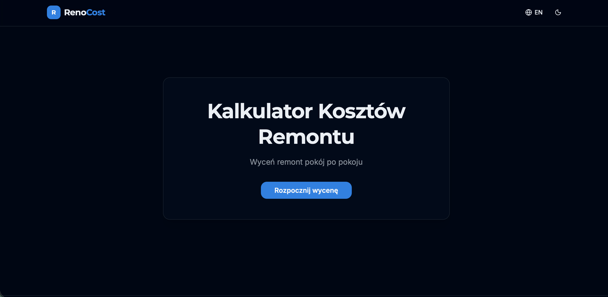 |

### Krok 1 — Pomieszczenia

| Tryb jasny | Tryb ciemny |
|:---:|:---:|
| 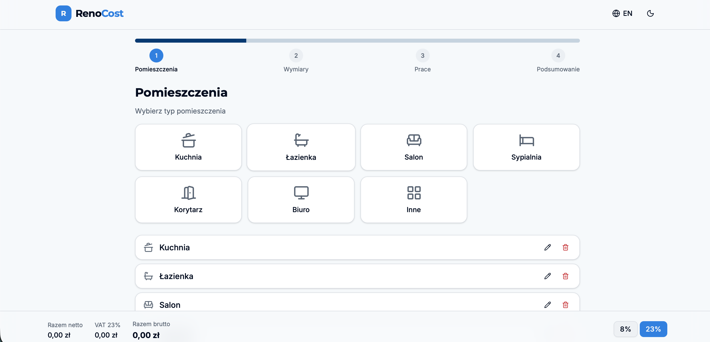 | 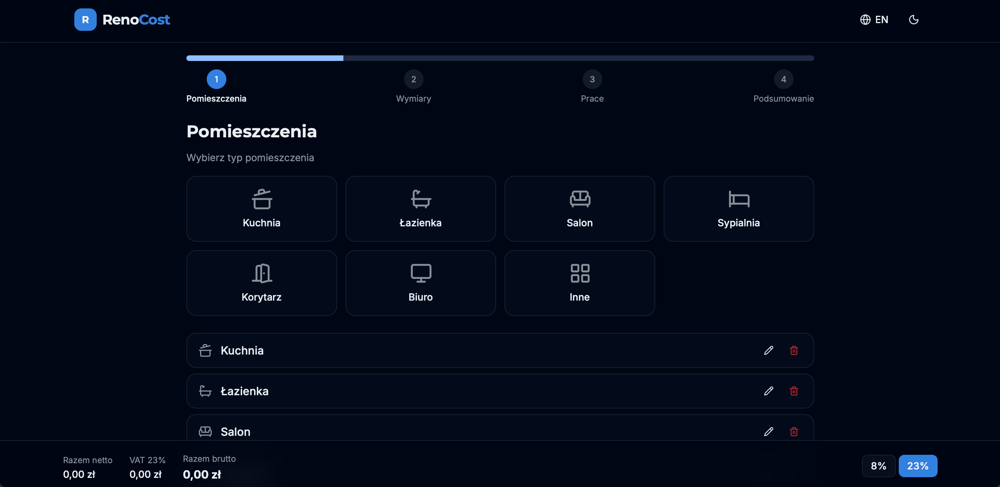 |

### Krok 2 — Wymiary

| Tryb jasny | Tryb ciemny |
|:---:|:---:|
| 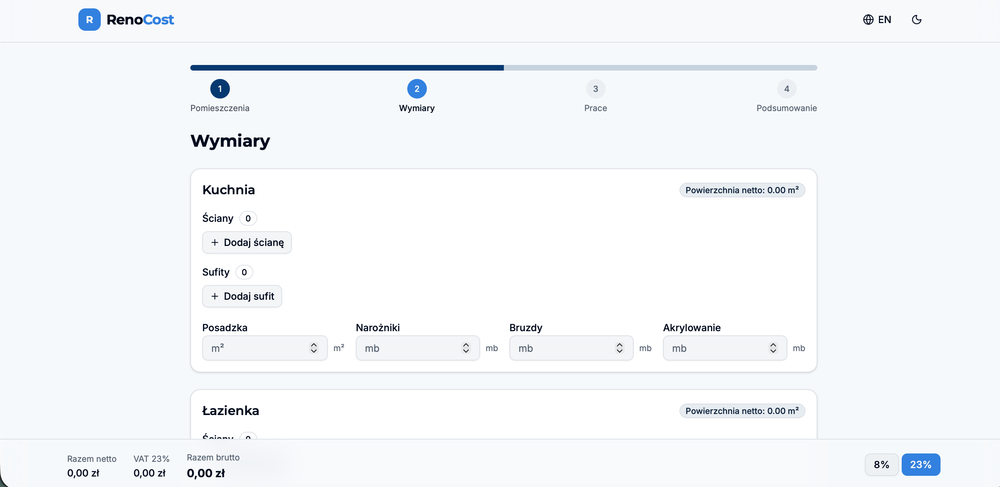 | 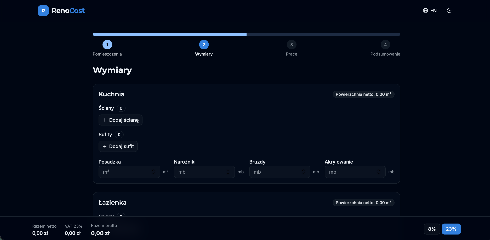 |

### Krok 3 — Prace remontowe

| Tryb jasny | Tryb ciemny |
|:---:|:---:|
| 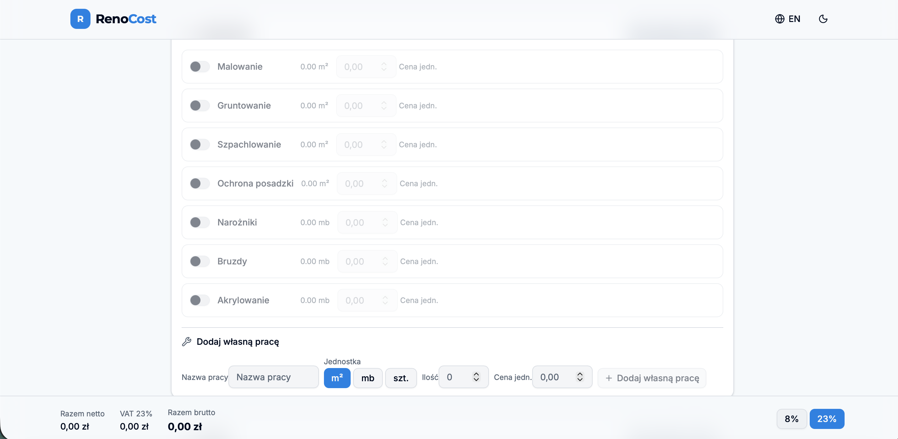 | 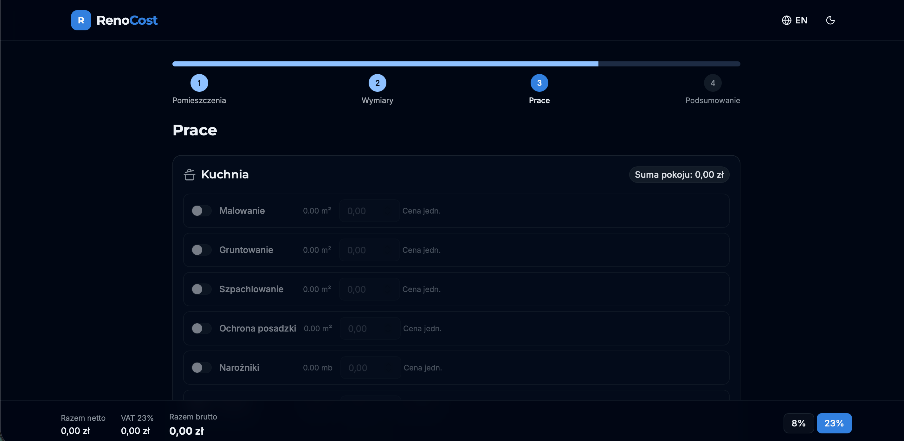 |

| Własne prace (jasny) | Własne prace (ciemny) |
|:---:|:---:|
|  | 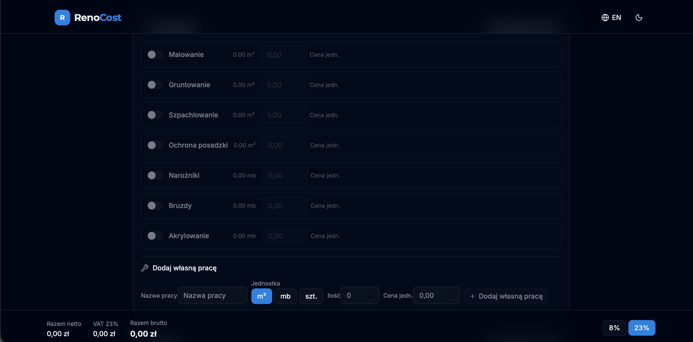 |

### Krok 4 — Podsumowanie i eksport PDF

| Tryb jasny | Tryb ciemny |
|:---:|:---:|
| 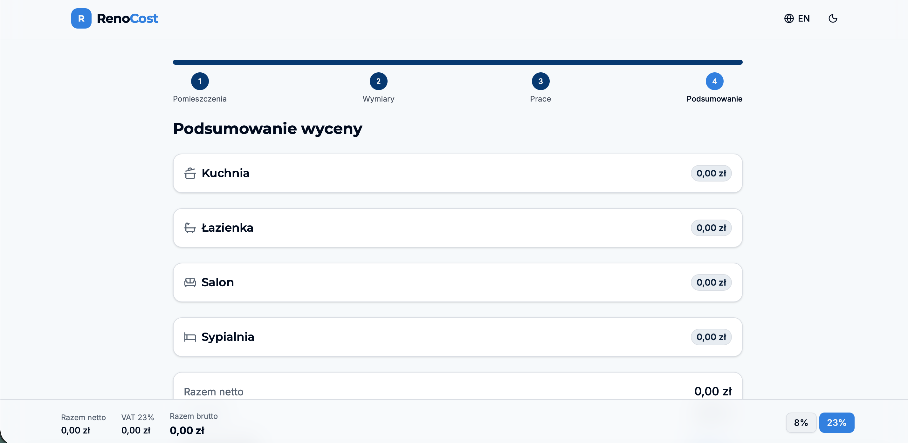 | 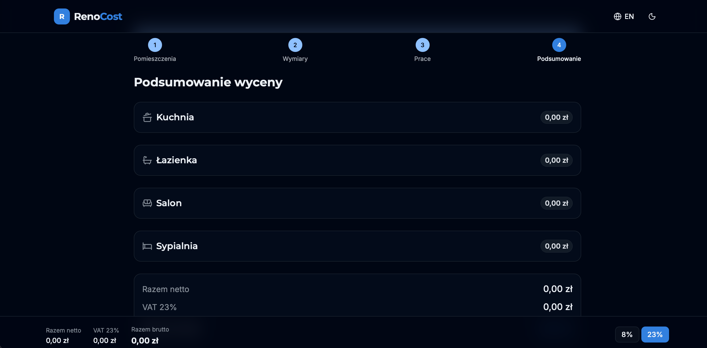 |
| 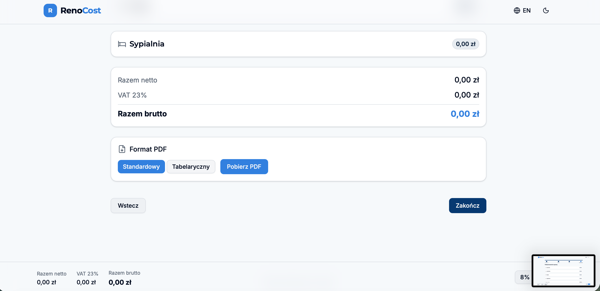 | 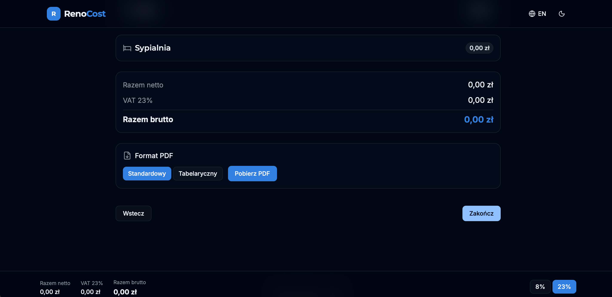 |

## Funkcje

- Kreator krok po kroku: pomieszczenia, wymiary, prace, podsumowanie
- 7 typów pomieszczeń (kuchnia, łazienka, salon, sypialnia, korytarz, biuro, inne)
- Predefiniowane prace remontowe z automatycznym obliczaniem ilości
- Własne prace remontowe
- Obliczanie netto, VAT i brutto
- Eksport do PDF (format standardowy i tabelaryczny)
- Tryb jasny / ciemny
- Polski i angielski interfejs

## Technologie

- React 19 + TypeScript
- Vite
- Tailwind CSS v4
- Zustand (zarządzanie stanem)
- @react-pdf/renderer (generowanie PDF)
- i18next (internacjonalizacja)
- GitHub Pages (hosting)

## Uruchomienie lokalne

```bash
pnpm install
pnpm dev
```

## Autor

Wojciech Olszak

## Licencja

[MIT](LICENSE)

---

# RenoCost - Renovation Cost Calculator

[**Open the app**](https://selter2001.github.io/renovation-cost-app/)

A renovation cost calculator for apartments. Add rooms, enter dimensions, select renovation works, and get a detailed estimate with PDF export.

## Screenshots

### Home page

| Light mode | Dark mode |
|:---:|:---:|
|  |  |

### Step 1 — Rooms

| Light mode | Dark mode |
|:---:|:---:|
|  |  |

### Step 2 — Dimensions

| Light mode | Dark mode |
|:---:|:---:|
|  |  |

### Step 3 — Renovation works

| Light mode | Dark mode |
|:---:|:---:|
|  |  |

| Custom works (light) | Custom works (dark) |
|:---:|:---:|
|  |  |

### Step 4 — Summary & PDF export

| Light mode | Dark mode |
|:---:|:---:|
|  |  |
|  |  |

## Features

- Step-by-step wizard: rooms, dimensions, works, summary
- 7 room types (kitchen, bathroom, living room, bedroom, hallway, office, other)
- Predefined renovation works with automatic quantity calculation
- Custom renovation works
- Net, VAT, and gross total calculation
- PDF export (standard and tabular format)
- Light / dark mode
- Polish and English interface

## Tech Stack

- React 19 + TypeScript
- Vite
- Tailwind CSS v4
- Zustand (state management)
- @react-pdf/renderer (PDF generation)
- i18next (internationalization)
- GitHub Pages (hosting)

## Running locally

```bash
pnpm install
pnpm dev
```

## Author

Wojciech Olszak

## License

[MIT](LICENSE)
